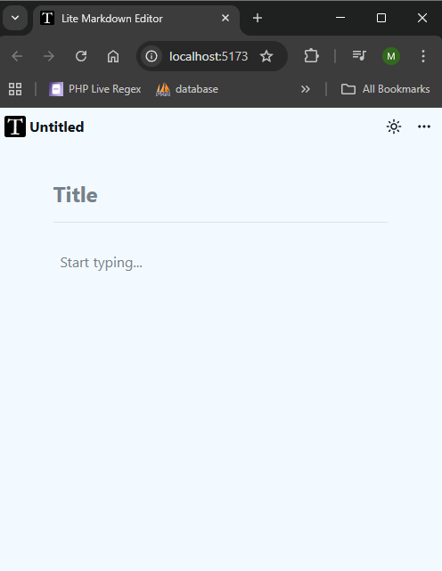
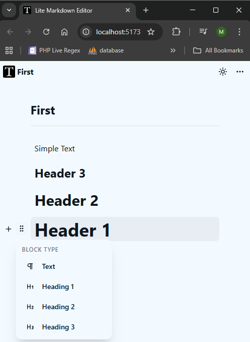
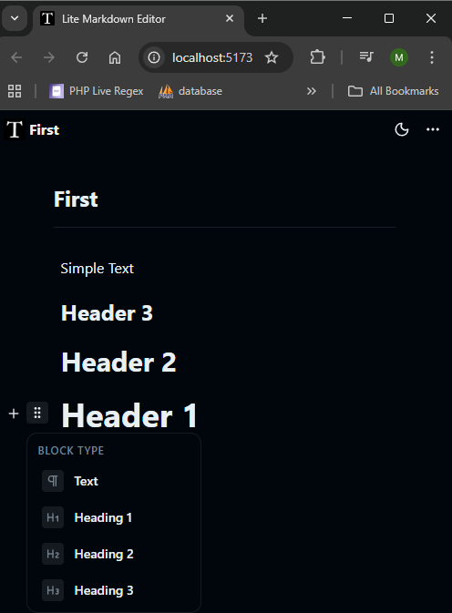

<h1 style="display: flex; align-items: center; gap: 8px;">
  
  Lite Markdown Editor
</h1>

A minimal and beautiful markdown-like block editor built with React and Framer-like block management ( Notion Like ).

## Preview





## Setup

### Clone repo

```bash
git clone https://github.com/devmoamal/LiteMarkdownEditor
cd LiteMarkdownEditor
```

### Install packages

```bash
npm install
```

### Run dev server

```bash
npm run dev
```

## Technologies

- Vite
- ReactJs
- Typescript
- Tailwindcss v4
- Zustand
